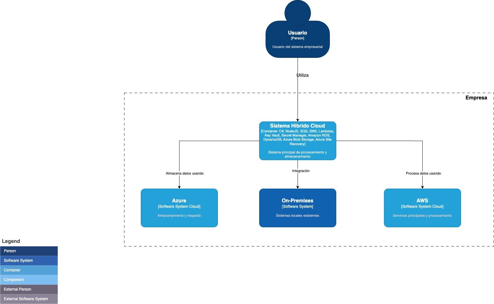
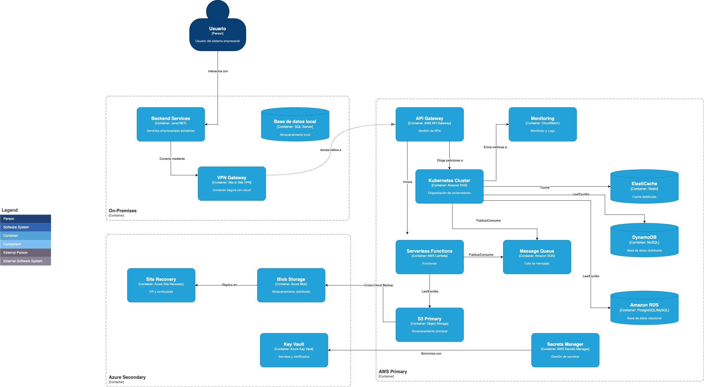

## Diagrama de arquitectura bajo modelo C4
Se aborda bajo el modelo C4 el diagrama de arquitectura, por la ventaja que proporciona que es fácil de entener para diferentes audiencias, divide en 4 niveles; es escalable y detallado sin perder la claridad.

Para este reto se aborda hasta el nivel 2 del modelo C4.

## 🏗 C1 - Diagrama de Contexto
Este diagrama muestra una vista general de los actores y sistemas involucrados.

## 🏗 C2 - Diagrama de Contenedores
Representa los contenedores de software principales y cómo interactúan entre sí.

